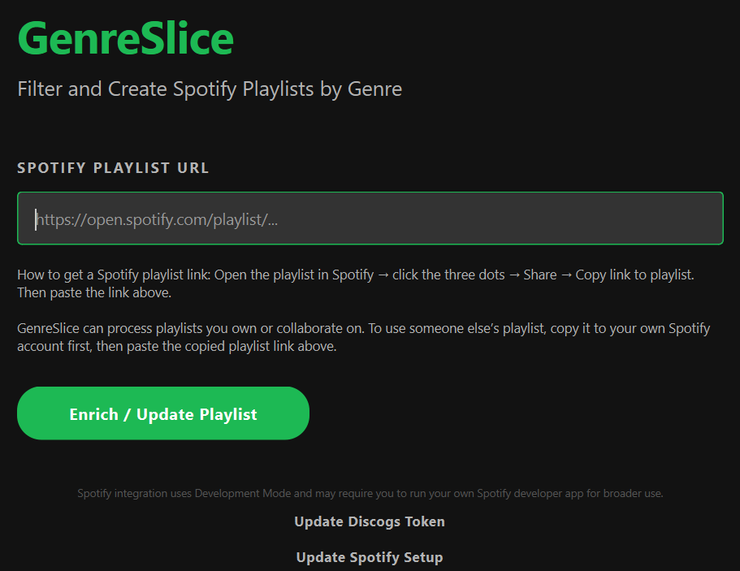
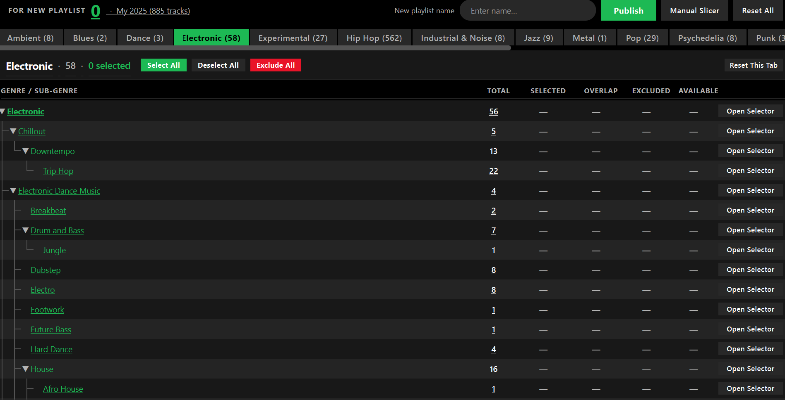
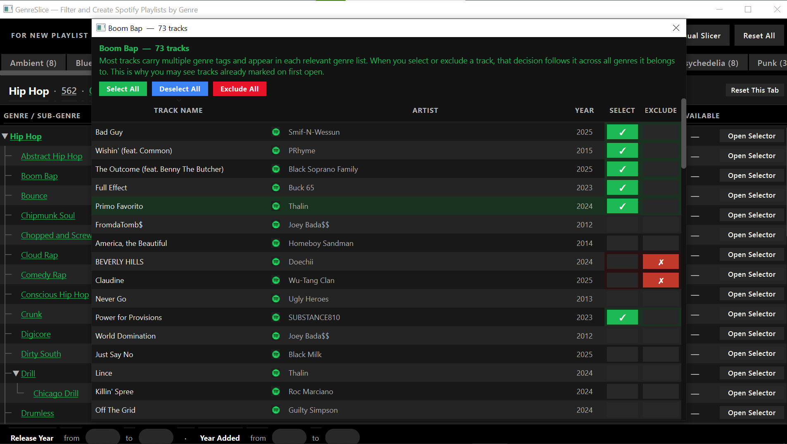
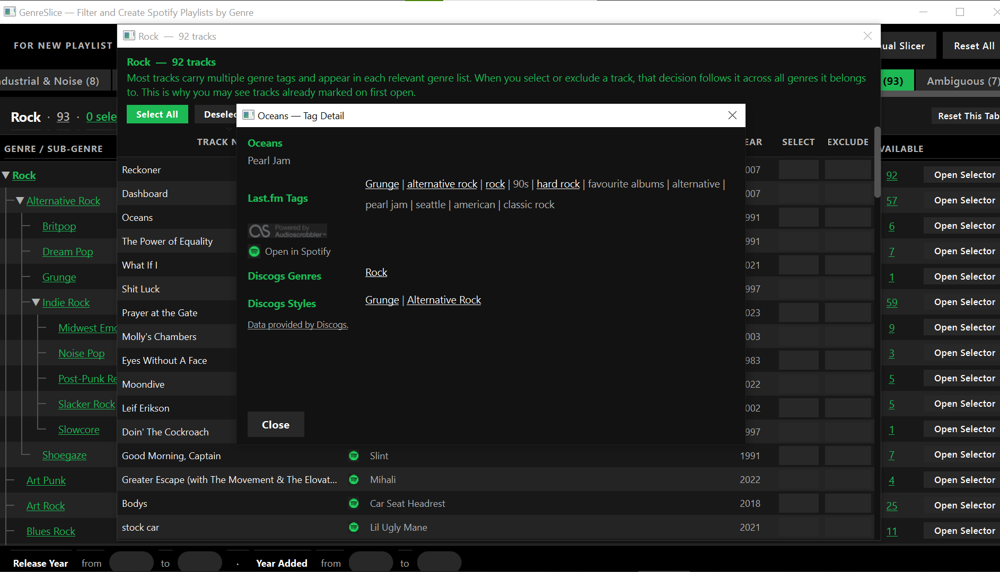
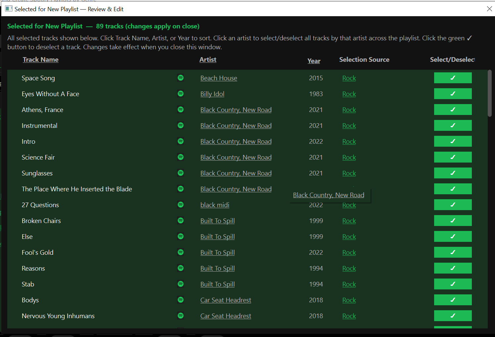

# GenreSlice

## Filter and Create Spotify Playlists by Genre

If you’ve ever tried to filter a Spotify playlist by genre, then you’ve experienced the frustration of gaps and obscurity in genre data, not to mention that genre filtering is not available within Spotify.

Many third-party apps include genre filters, but rely on Spotify’s genre data, which is often missing, vague, or unrecognizable.

GenreSlice enriches Spotify playlists with genre tags from Discogs and Last.fm — the two most widely used music cataloging spaces in the world.

Start with any Spotify playlist. GenreSlice builds an interactive genre browser, lets you quickly filter and customize your selections, lets you preview the tracks in each slice, and publishes your selected tracks as a new Spotify playlist.

---

## Download

Current release:

**GenreSlice v1.0.0 Beta**

[Download GenreSlice v1.0.0 Beta](https://github.com/G-slice1/GenreSlice/releases/tag/v1.0.0-beta)

Installer:

```text
GenreSliceSetup_v1.0.0-beta.exe
```

SHA-256:

```text
F7E6585257C970DB58AFCE7FD4B641D8046DA34E3DA1C3D86D32A9460768098A
```

---

## Windows SmartScreen Notice

GenreSlice is a new independent Windows app and the initial beta installer is not code-signed.

Windows SmartScreen may warn that the app is from an unknown publisher or is not commonly downloaded. This does not mean the file is unsafe.

---

## What GenreSlice Does

GenreSlice lets you:

- load a Spotify playlist
- enrich tracks with genre data from Discogs and Last.fm
- browse genres in an interactive taxonomy tree
- filter tracks by genre family, specific genre, user-selected tags via the manual slicer window, release year range, and added-to-playlist time range
- preview the tracks in each selection
- create a new Spotify playlist from the selected tracks

GenreSlice does not modify your original playlist.

---

## Screenshots



*Start with a Spotify playlist link.*



*Browse the playlist by genre, subgenre, and track count.*



*Preview and select tracks inside a genre slice.*



*See Discogs, Last.fm, and Spotify links behind each track.*



*Review your final slice before publishing.*

---

## Requirements

GenreSlice currently requires:

- Windows
- a Spotify Premium account
- an internet connection while processing playlists

GenreSlice guides you through Spotify and Discogs setup inside the app.

---

## Install

1. Download `GenreSliceSetup_v1.0.0-beta.exe` from the official GitHub release page.
2. Run the installer.
3. Open GenreSlice.
4. Choose a data folder for your playlist workspaces.
5. Follow the in-app Spotify and Discogs setup prompts.
6. Paste a Spotify playlist link and run GenreSlice.

---

## Spotify Playlist Access

GenreSlice can process playlists you own or collaborate on.

To use someone else’s playlist, copy it to your own Spotify account first, then paste the copied playlist link into GenreSlice.

In Spotify, you can usually do this from the playlist menu:

```text
Three dots → Add to other playlist → New playlist
```

Then copy the link to your new playlist and paste it into GenreSlice.

---

## Data Sources

GenreSlice uses:

- Spotify for playlist access, track links, and playlist publishing
- Discogs for release metadata and genre/style data
- Last.fm for album, artist, and track tag data

GenreSlice is not affiliated with, sponsored by, or endorsed by Spotify, Discogs, or Last.fm.

---

## Known Limitations

GenreSlice is a beta release.

Known limitations:

- first-time processing can take a while, especially for large playlists
- some tracks may have limited or missing metadata
- genre classification depends on available Discogs and Last.fm data
- Windows may show a SmartScreen warning because the installer is unsigned

---

## Troubleshooting / Expected Issues

This section covers the most common setup and recovery situations for GenreSlice.

### Spotify setup problem

If Spotify setup fails, open GenreSlice and run **Update Spotify Setup** again.

Confirm that:

- your Spotify Client ID is copied correctly
- your redirect URI matches the one shown in GenreSlice
- the redirect URI is also saved in your Spotify Developer Dashboard

Then try the setup again.

### Discogs token problem

If GenreSlice reports a Discogs token problem, run **Update Discogs Token** again.

Paste a valid Discogs personal access token, save it, and rerun the playlist.

### Playlist access problem

GenreSlice can process Spotify playlists that your account can access, including playlists you own or collaborate on.

For someone else’s playlist, the safest workaround is:

1. open the playlist in Spotify
2. copy it to your own Spotify account
3. paste the copied playlist link into GenreSlice

### Temporary network or API problem

GenreSlice uses online music services, so temporary network or API failures can happen.

If this occurs:

- wait a few minutes
- try again
- if GenreSlice offers **Retry Now**, use it

### Unresolved data warning

Sometimes GenreSlice may finish with some missing metadata.

When this happens, you can choose:

- **Retry Now** to try fetching the missing data again
- **Continue to GenreSlice** if you accept that some metadata may be missing

### Spotify rate-limit message

If GenreSlice shows a Spotify rate-limit message, wait the amount of time shown by GenreSlice, then retry.

### Diagnostic logs

Diagnostic logs are stored on your computer at:

```text
%LOCALAPPDATA%\GenreSlice\logs
```

These logs can help troubleshoot setup, playlist access, network, and API issues.

### Cache and state files

GenreSlice creates caches, logs, and state files on your computer while it runs.

These files are not bundled in the installer.

---

## Release

Current release:

```text
GenreSlice v1.0.0 Beta
```

Installer:

```text
GenreSliceSetup_v1.0.0-beta.exe
```

SHA-256:

```text
F7E6585257C970DB58AFCE7FD4B641D8046DA34E3DA1C3D86D32A9460768098A
```
